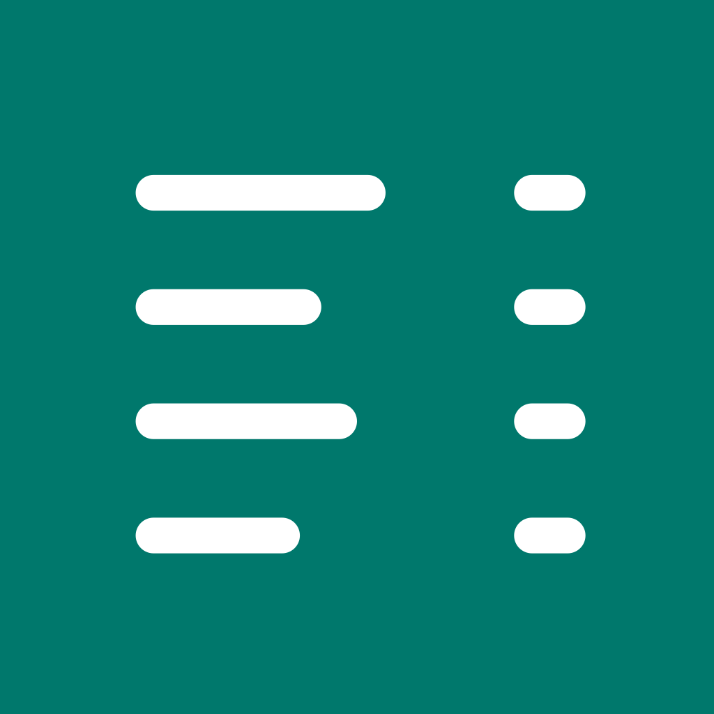
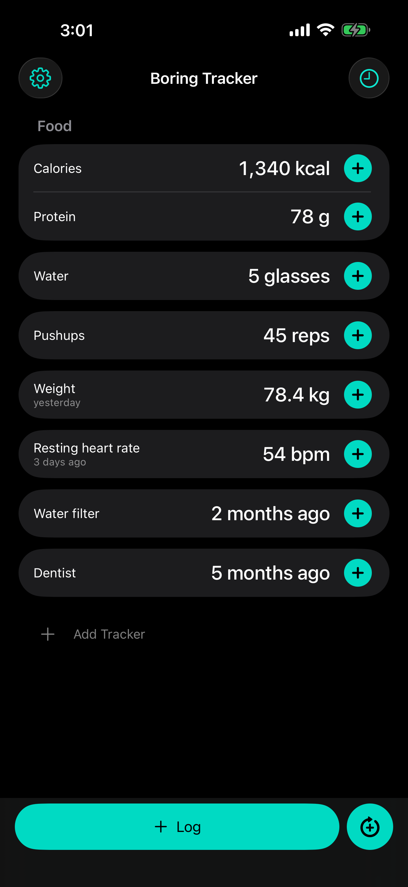
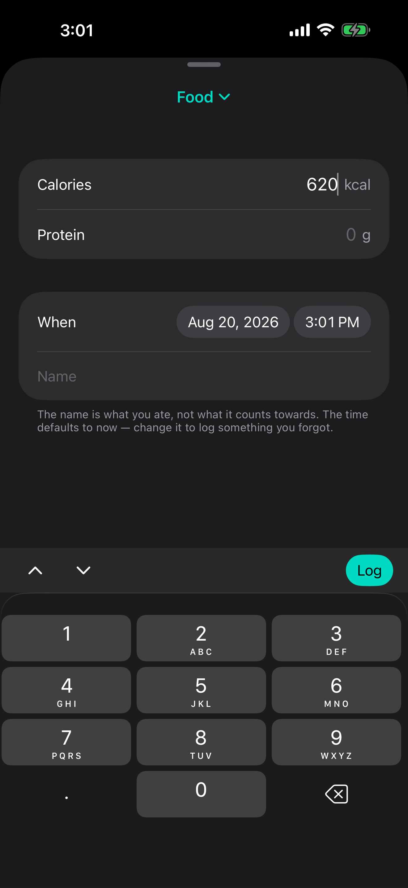
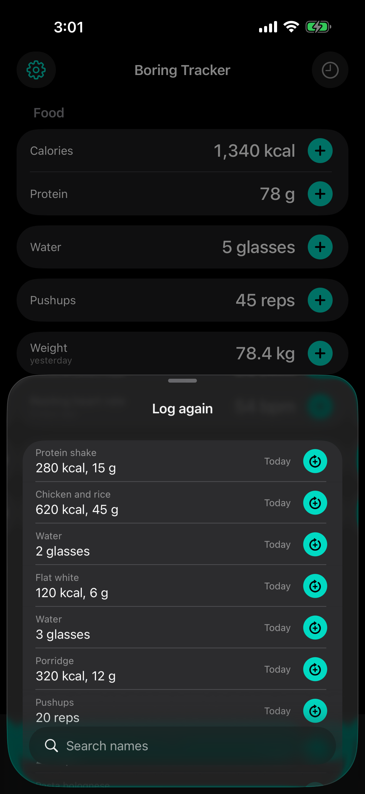
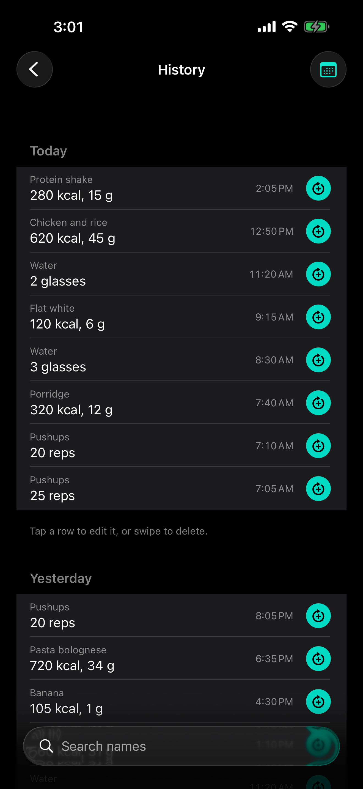
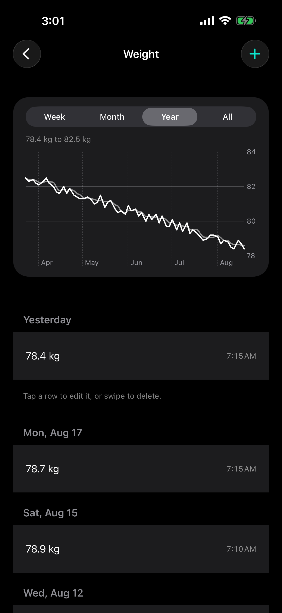

<p align="center">
  
</p>

<h1 align="center">Boring Tracker</h1>

<p align="center">
  iPhone app for tracking whatever you want — macros, habits, or any other data.
</p>

<p align="center">
  <a href="https://github.com/novoselov-ab/boring-tracker/actions/workflows/ci.yml"></a>
</p>

Free, open source, no ads, no accounts, no subscription, no server, no feature
bloat. Type a number, done.

Most other macro trackers want you to scan a barcode for every ingredient of a
dish you cooked yourself. It takes a lot of time for no benefit. This one just
lets you write down `600 calories, 40 protein` and done, as fast as possible,
minimum clicks, minimum wait/lag.

You can also use it to track anything you want: your cat's weight, pushups,
blood glucose, the last time you changed a filter.

The app is open source and stores everything on your own device. You can always
export all your data as json/csv, or import it back. It is absolutely free, has
no ads, and never will have any. My goal with it is to behave like a built-in
iOS app (e.g. the calculator). It is boring, but does its job, hence the name.

It is early: the design is settled and written down, the app is being built,
and it is not on the App Store yet.

## Screenshots

<p align="center">
  
  
  
  
  
</p>

<p align="center">
  <sub>Home · the log sheet · log again · history · a graph</sub>
</p>

## Features

This is the minimum set that makes the app useful. Nothing is here because
another tracker has it.

- **Daily totals** — calories, protein, water. Resets at your day boundary.
- **Measurements** — weight, blood glucose. A standalone reading, no reset.
- **Last time** — tyres, the water filter. One tap, no number: "2 months ago".
- **Groups**, so trackers you log together take one sheet.
- **Logging** — the + opens what you logged last, with the number pad up.
- **Log again** — repeat anything you have logged, one tap, searchable.
- **History**, grouped by day and searchable. Edit, delete, undo.
- **Graphs** — bars, lines, moving average. Week, month, year, or all of it.
- **Export and import** — JSON or CSV out, JSON back in.
- **Archive** a tracker without losing its data.
- **Settings** — day boundary, light or dark, and the trackers themselves.

Why each of these exists, and what was left out, is in
[docs/PRODUCT.md](docs/PRODUCT.md).

Issues and pull requests are welcome. Both get judged against
[docs/PHILOSOPHY.md](docs/PHILOSOPHY.md), so read it first — a feature can be
good and still be wrong for this app, and most of the rules there exist to say
no to something.

## Support

If the app is useful to you and you want to support the developer, there is
nothing to click — I do not take donations and there is no button for it
anywhere. What helps instead:

- Give the money to a charity of your choice.
- Leave a review on the App Store.
- Email me at [novoselov.ab@gmail.com](mailto:novoselov.ab@gmail.com). I would
  be glad to hear it is useful.

## Building it

You need Xcode 26. Nothing else — no package manager, no dependencies to
fetch, no Apple developer account:

```sh
open BoringTracker.xcodeproj
```

Pick an iPhone simulator and press ⌘R to run, or ⌘U to run the tests. The
`.xcodeproj` is committed so this works on a fresh clone, and the app target
is configured without code signing so the simulator needs no account. Running
on a real iPhone does need one — set your team in Signing & Capabilities.

From a terminal instead:

```sh
xcodebuild test -project BoringTracker.xcodeproj -scheme BoringTracker \
  -destination 'platform=iOS Simulator,name=iPhone 17'
```

[`project.yml`](project.yml) is the source of truth for the project, so if you
change it — or add a source file, since it lists them — regenerate with
[XcodeGen](https://github.com/yonaskolb/XcodeGen) and commit the result:

```sh
brew install xcodegen && xcodegen generate
```

Your data lives in one JSON file inside the app container. With a simulator
booted and the app installed on it:

```sh
open "$(xcrun simctl get_app_container booted com.novoselov.boringtracker data)/Library/Application Support/boring-tracker"
```

## Docs

- [Philosophy](docs/PHILOSOPHY.md) — the spirit, and the rules that must not be
  broken.
- [Product](docs/PRODUCT.md) — what the app actually is: the model, the
  screens, the scope.
- [Tech](docs/TECH.md) — how it's built, and why, with the benchmarks behind
  the storage decision.
- [Scale](docs/scale.md) — what five years of use (29,756 entries) does to the
  app, measured screen by screen.
- [Shipping](docs/SHIPPING.md) — Apple accounts, costs, and App Store
  submission.
- [App Store](docs/APPSTORE.md) — the listing text and everything else the
  submission needs.
- [TODO](docs/TODO.md) — the short list of what's left, on the front of a much
  longer record of what was decided and why, including the things that were
  built, measured and reverted.

## License

MIT — see [LICENSE](LICENSE). Fork it, build it, ship your own; rule 8 of the
philosophy is that you can.
