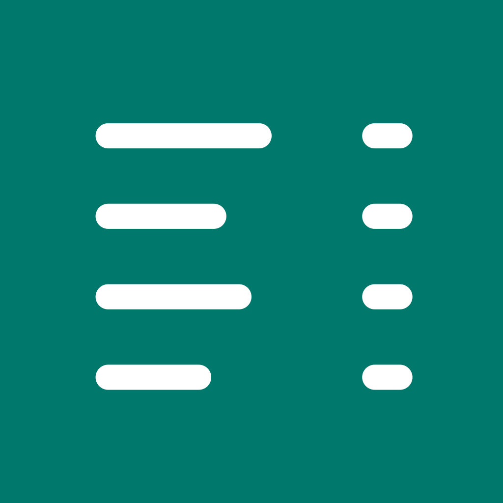
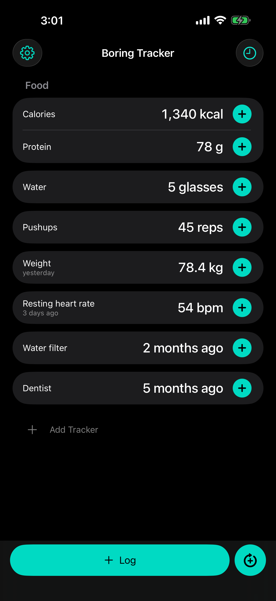
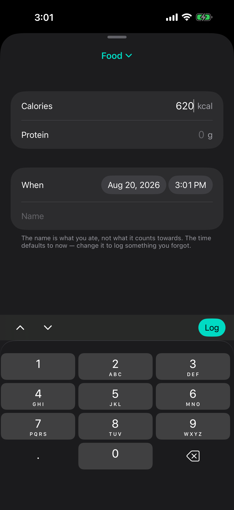
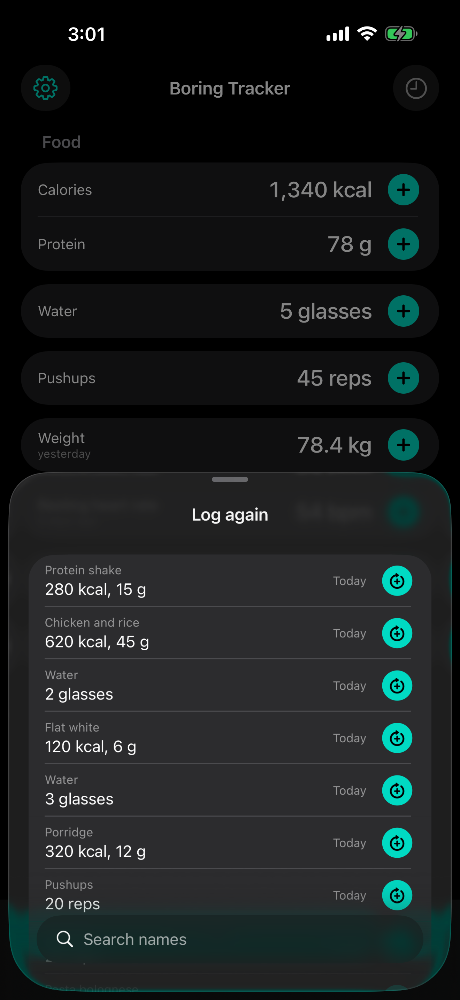
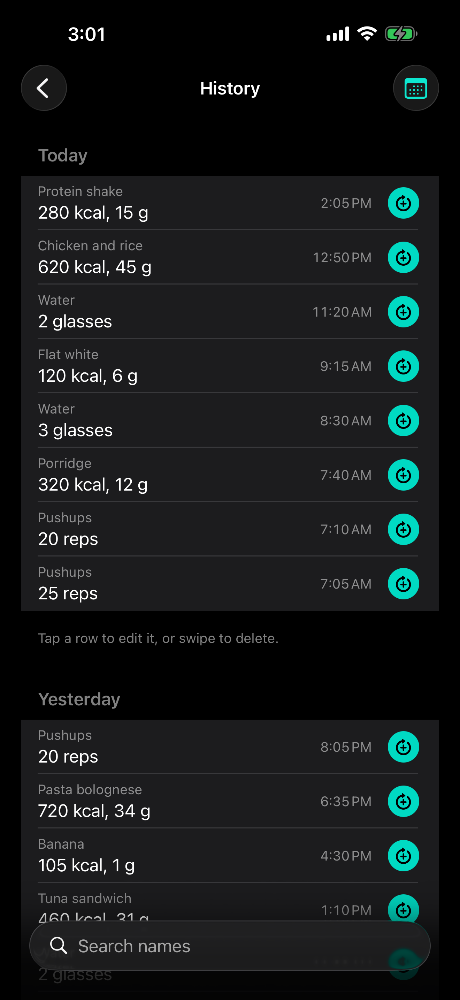
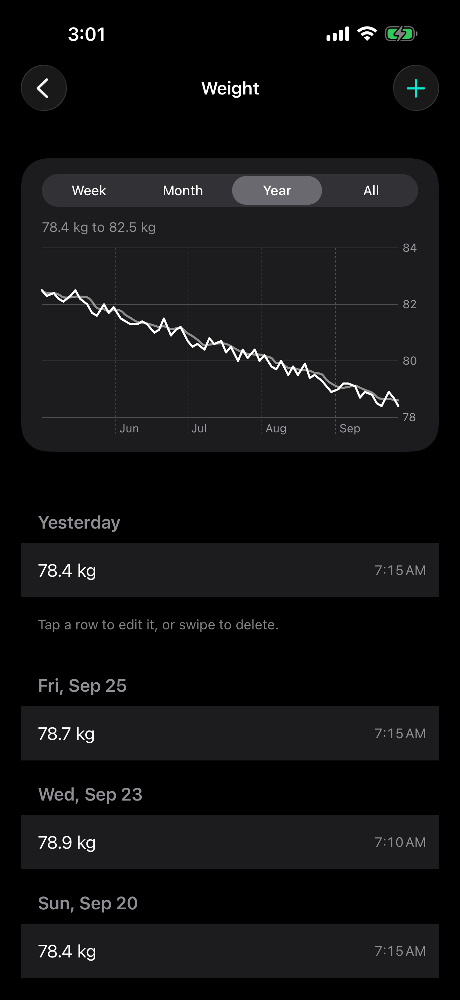

#  Boring Tracker

iPhone and iPad app for tracking whatever you want — macros, habits, or any
other data.

**[Download on the App Store](https://apps.apple.com/app/id6803768789)** —
free, iOS / iPadOS 18 or later.

[](https://github.com/novoselov-ab/boring-tracker/actions/workflows/ci.yml)

Free, open source, no ads, no accounts, no subscription, no server.

Most macro trackers want you to scan a barcode for every ingredient of a dish
you cooked yourself. That takes a lot of time for no benefit. This app just
lets you write down `600 calories, 40 protein`, with as few taps as possible
and no waiting.

It works for more than food: weight, pushups, blood glucose, your cat's
weight, or when you last changed a filter.

Everything is stored on your device, and you can export it all as JSON or CSV
(and import it back) whenever you want. The goal is for the app to feel like a
built-in iOS app, like the calculator: boring, but it does its job. Hence the
name.

Version 1.1 is on the App Store. The design is settled and written down, and
[docs/TODO.md](docs/TODO.md) lists what is left.

## Screenshots

<p align="center">
  
  
  
  
  
</p>

<p align="center">
  <sub>Home · the log sheet · log again · history · a graph</sub>
</p>

## Features

The feature list is short on purpose:

- **Daily totals** — calories, protein, water. Entries add up and reset at
  your day boundary.
- **Measurements** — weight, blood glucose. Standalone readings with no reset.
- **Last time** — tyres, the water filter. One tap records the date, and the
  app shows how long it has been.
- **Groups** — trackers you log together share one sheet.
- **Logging** — the + button opens what you logged last, with the number pad
  already up.
- **Log again** — repeat any past entry with one tap; the list is searchable.
- **History** — grouped by day and searchable, with edit, delete, and undo.
- **Graphs** — bars or lines with a moving average, over a week, month, year,
  or everything.
- **Export and import** — JSON or CSV out, JSON back in.
- **Archive** — retire a tracker without losing its data.
- **Settings** — day boundary, light or dark, and the trackers themselves.

Why each of these exists, and what was left out, is in
[docs/PRODUCT.md](docs/PRODUCT.md).

Issues and pull requests are welcome. Read
[docs/PHILOSOPHY.md](docs/PHILOSOPHY.md) first: it is the list of rules the
app follows, and features get judged against it, so a feature can be good and
still not fit this app.

## Support

If you want to support the app: leave
[a review on the App Store](https://apps.apple.com/app/id6803768789?action=write-review),
share it with someone who would use it, or email me at
[novoselov.ab@gmail.com](mailto:novoselov.ab@gmail.com) — I am glad to hear it
is useful. If you want to give money, give it to a charity instead;
[GiveWell](https://www.givewell.org) is the one I recommend.

## Building it

You need Xcode 26. Nothing else — no package manager, no dependencies to
fetch, no Apple developer account:

```sh
open BoringTracker.xcodeproj
```

Pick an iPhone simulator and press ⌘R to run, or ⌘U to run the tests. The
`.xcodeproj` is committed so this works on a fresh clone, and the app target
is configured without code signing so the simulator needs no account. Running
on a real iPhone does need one — set your team in Signing & Capabilities.

From a terminal instead:

```sh
xcodebuild test -project BoringTracker.xcodeproj -scheme BoringTracker \
  -destination 'platform=iOS Simulator,name=iPhone 17'
```

[`project.yml`](project.yml) is the source of truth for the project, so if you
change it — or add a source file, since it lists them — regenerate with
[XcodeGen](https://github.com/yonaskolb/XcodeGen) and commit the result:

```sh
brew install xcodegen && xcodegen generate
```

Your data lives in one JSON file inside the app container. With a simulator
booted and the app installed on it:

```sh
open "$(xcrun simctl get_app_container booted com.novoselov.boringtracker data)/Library/Application Support/boring-tracker"
```

## Docs

- [Website](https://novoselov-ab.github.io/boring-tracker/) — the landing page
  ([docs/index.html](docs/index.html)), with the
  [privacy policy](https://novoselov-ab.github.io/boring-tracker/privacy.html)
  on its own page ([docs/privacy.html](docs/privacy.html)).
- [Philosophy](docs/PHILOSOPHY.md) — the rules the app follows and the reasons
  for them.
- [Product](docs/PRODUCT.md) — the data model, the screens, and the scope.
- [Tech](docs/TECH.md) — how it's built and why, with the benchmarks behind
  the storage decision.
- [Scale](docs/scale.md) — how the app holds up after five years of data
  (29,756 entries), measured screen by screen.
- [Shipping](docs/SHIPPING.md) — Apple accounts, costs, and App Store
  submission.
- [App Store](docs/APPSTORE.md) — the listing text and everything else the
  submission needs.
- [TODO](docs/TODO.md) — what is left to do, and the record of past decisions,
  including things that were built, measured and reverted.

## License

MIT — see [LICENSE](LICENSE). You are free to fork it, build it, and ship your
own version.
